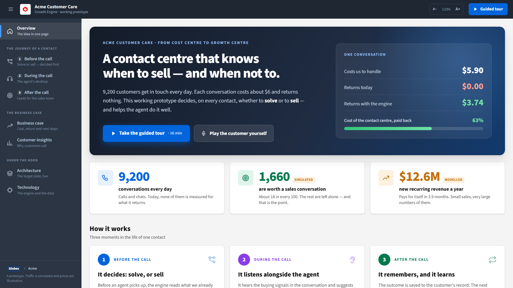
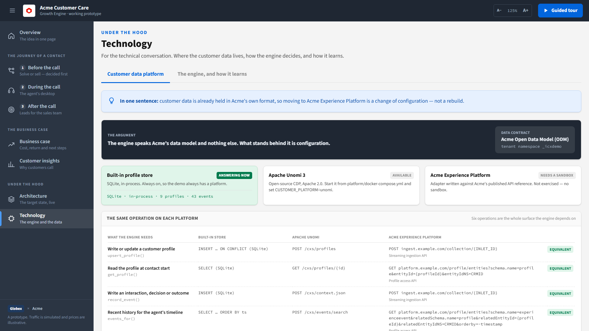
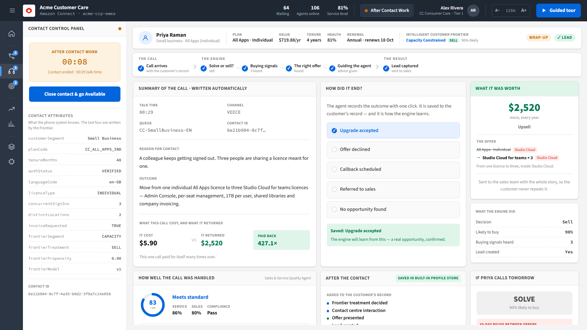
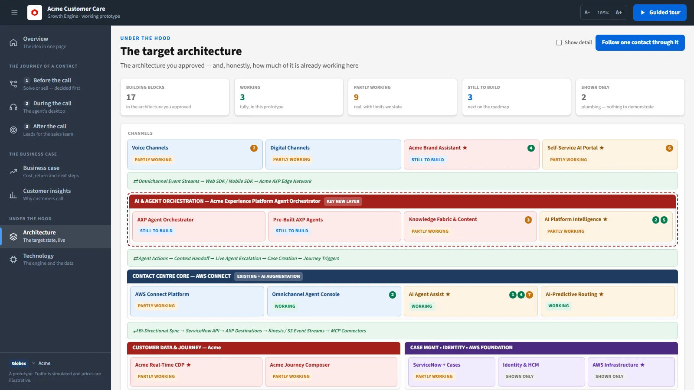

# Growth Engine — from cost centre to growth centre

A working prototype of a contact centre that decides, on every contact, whether to
**solve** or to **sell** — and knows when not to.

Every contact is treated *before* it reaches an agent: scored, segmented, and held back
by guardrails where it should be. A support conversation that contains a real opportunity
ends as a qualified lead. One that contains a complaint never becomes a sales pitch.

It runs on one laptop, offline, with one command. There is no build step.

**[Try the decision engine in your browser →](https://saurabh-oss.github.io/icx-growth/)**



> **The company in this repository is fictional.** Acme, its products and its delivery
> partner Globex are invented, and so are the customers, prices and help articles. To
> show the demo as a real company without editing the code, add a
> [brand pack](#brand-packs--show-it-as-your-company).

---

## Contents

- [What is real, and what is not](#what-is-real-and-what-is-not)
- [Quick start](#quick-start)
- [Brand packs](#brand-packs--show-it-as-your-company)
- [The guided tour](#the-guided-tour--12-steps-about-16-minutes)
- [Intelligent Customer Frontier](#intelligent-customer-frontier) — the decision engine
- [Customer data platform](#customer-data-platform)
- [Agent workspace](#agent-workspace)
- [After the contact](#after-the-contact)
- [The seven agents](#the-magnificent-7)
- [The business case](#the-business-case)
- [Architecture coverage](#coverage-of-the-target-architecture)
- [Folder structure](#folder-structure) · [Licence](#licence)

---

## What is real, and what is not

A prototype earns trust by saying where it stops. Everything on screen is labelled the
same way as this table.

| | Status | What that means |
|---|---|---|
| **Frontier decision engine** | Real | Propensity, segment, guardrails, routing and offer are computed from the customer's profile. Change the profile and the decision changes. |
| **Guardrails** | Real | Service recovery, consent, 30-day cooldown and commercial hold are code, covered by tests. |
| **Customer platform** | Real | Profiles and events in one data model, on a built-in store or on **Apache Unomi**. Both pass the same conformance tests. |
| **Feedback loop** | Real | A challenger model is trained on outcomes, judged on unseen traffic, and promoted by a person. |
| **Unscripted contact** | Real | Type or speak as the customer. A rules engine detects signals, scores and recommends. No API key needed. |
| **Quality scoring, knowledge retrieval, self-service** | Real | Each runs on whatever transcript or question it is given. |
| **Write-back** | Real | Wrap-up writes events to the profile; the next decision for that customer reflects them. |
| **Training mode** | Real | A human agent takes a mock call in audio. The customer is played by a rules-based persona built from the demo contacts; the scoring and debrief are the quality agent's. |
| **Traffic** | **Synthetic** | 9,200 contacts a day from a generated population of 6,000 customers. No real customer data anywhere. |
| **The nine guided contacts** | **Scripted** | Conversation and analysis are written in advance so the demo lands the same way every time. |
| **Knowledge articles and prices** | **Illustrative** | Plausible, invented. |
| **Translation on Lucía's contact** | **Prepared** | The routing and workspace are real; the Spanish and English text was written in advance. |
| **Journeys, cases** | **Stand-in** | Journeys and cases are composed and shown, not sent anywhere. |
| **Amazon Connect** | **Emulated** | The workspace looks and behaves like a Connect agent desktop. It is not connected to a Connect instance. |
| **The vendor's experience platform** | **Not exercised** | An adapter is written and configurable, with placeholder endpoints. It has never made a request. |
| **The business case** | **Modelled** | $12.6M ARR, 3.9-month payback: assumptions, stated as assumptions. |

---

## Quick start

**Needs:** Python 3.9 or later. Nothing else.

```cmd
:: Windows
run.bat
```

```bash
# macOS, Linux
./run.sh
```

Either installs the dependencies, starts the server and opens http://localhost:8000.
To start it by hand: `pip install -r requirements.txt`, then `python backend/main.py`.

**Optional — Claude on top.** With a key set, Claude reads each conversation and its
analysis is layered over the engine's. Without one, everything still works.

```bash
export ANTHROPIC_API_KEY=sk-ant-your-key-here      # Windows: set ANTHROPIC_API_KEY=...
```

**Optional — Apache Unomi as the customer platform.** Needs Docker.

```bash
cd platform && docker compose up -d && cd ..
export CUSTOMER_PLATFORM=unomi                     # Windows: set CUSTOMER_PLATFORM=unomi
python backend/main.py
```

The first start pulls about 1.5 GB and takes a minute or two. If Unomi is not reachable
the app says so at start-up and uses the built-in store — a stopped container cannot
take the demo down. `docker compose stop` in `platform/` stops it and keeps the data.

**Run the tests.** 43 tests, about five seconds, no server and no network.

```bash
python -m unittest discover -s tests -v
```

With Unomi running, the platform conformance tests run against it as well.

Settings are read from the environment; `.env.example` lists them. The app does not load
a `.env` file.

---

## Brand packs — show it as your company

The demo is most convincing when it carries the name of the company in the room. It
should not take a fork, or a search-and-replace, to do that.

```
brand/default.json     committed        the fictional company, as shipped
brand/local.json       ignored by git   yours: names, mark, colours, endpoints
```

Copy `brand/default.json` to `brand/local.json`, move the entries you want from
`example_names` into `names`, and change the right-hand side:

```json
{
  "names": {
    "Acme": "Your Company",
    "Globex": "Your Partner",
    "Studio Cloud": "Your Product Suite",
    "PhotoForge": "Your Photo Product"
  },
  "logo": { "viewBox": "0 0 100 100", "shapes": [{ "d": "M10 10h80v80H10z" }] },
  "partner": { "colour": "#1f3a5f" }
}
```

Restart the app. The start-up banner names the pack in use.

**How it works.** `backend/main.py` loads the pack before anything else. If the pack has
names, an import hook substitutes them into the application's own modules as they are
imported, and into the page as it is served. Every figure, decision and sentence is
otherwise identical — a test asserts that a pack changes names and nothing else. With no
local pack, no hook is installed: the code you read is the code that runs.

| | |
|---|---|
| `BRAND_PACK=default` | Ignore `brand/local.json` |
| `BRAND_PACK=path/to/pack.json` | Use that pack |
| Whole words only | `Acme` never matches inside `AcmeMark`. Matching is case-sensitive |
| Characters not allowed in a name | Quotes, backslash, angle brackets, braces, backtick, `$` — a name is substituted into code and into a page, so it must be inert in both |
| `vendor_api` | Where the vendor's platform lives and what it calls things. Read by the adapter in `backend/cdp.py` |

**Before you publish a fork:** `brand/local.json` is ignored by git for a reason. Real
names, logos and trademarks belong to their owners. Keep them on your machine.

---

## Built for the room

The interface is written for directors and vice-presidents, most of whom will not be
technical.

| | |
|---|---|
| **It opens on Overview** | The idea in one page: what it costs today, what it could return, how it works in three steps, and four customers worth meeting. |
| **The menu is in words** | Grouped as *The journey of a contact* (before, during, after the call), *The business case* and *Under the hood*. It folds away during a call. |
| **Plain language** | "61% likely to buy", not "p 0.61". "Held back", not "override". The technical terms live on the Technology screen. |
| **Text that can be read from the back** | The size fits the screen it is shown on. **A− / A+** in the top bar overrides it, and the choice is remembered. |
| **One icon set** | Drawn, not emoji, so it looks the same on every machine. |

## The guided tour — 12 steps, about 16 minutes

Press **Take the guided tour** on the Overview, **Guided tour** in the top bar, or open
`?story=1`. The app navigates, selects the right customer and starts the right animation
at each step.

- **Chapter cards.** Each new chapter opens on a full-screen title for two seconds.
- **The audience sees one sentence.** The bar at the bottom shows the step's title and a
  plain takeaway. Nothing else.
- **The presenter's script is hidden until asked for.** Press **N** for what to say, what
  to point at, and the beat worth landing.
- **It points.** Whatever the step is about is ringed in blue and scrolled into view.
- **Jump anywhere.** Click the step counter for the chapter list.

`←` `→` to move, `N` for notes, `Esc` to leave. `?story=7` resumes at step 7. Figures in
the script are filled from what the engine computed, so the words always match the screen.

| | Act | Step | Screen |
|---|---|---|---|
| 1 | The volume | 9,200 conversations a day | Before the call — live traffic and the funnel |
| 2 | **Restraint** | It knows when not to sell | Elena — held back |
| 3 | Opportunity | Same engine, opposite call | Priya — what we already knew |
| 4 | The agent | The agent sees it before saying hello | Nine customers waiting, each decided |
| 5 | Story 1 | A sign-in complaint | Priya's call, live |
| 6 | Story 1 | One seat becomes three | Wrap-up — $2,520, and "if she calls tomorrow" |
| 7 | Story 2 | A customer with no problem to fix | Ravi's call, live |
| 8 | Story 2 | One product suite in, another out | Wrap-up — $3,600, specialist referral |
| 9 | **Your turn** | Now you be the customer | Unscripted call — *optional* |
| 10 | The foundation | Built on the vendor's own data model | Technology — customer data platform |
| 11 | The fit | Your target architecture, running | Architecture, one contact followed through |
| 12 | **The ask** | Two weeks, not two quarters | Business case — Value Discovery |

### Why this order

**Restraint comes before revenue.** The second thing shown is the engine *declining* to
sell. The first objection is always "won't this make my agents pushy?", so it is answered
by demonstration before any upside is presented.

**Two cases different in kind.** Case 1 expands a licence inside one product suite. Case 2
crosses into another — a recommendation a product-line sales team would never make off a
support call.

**The unscripted contact comes after the scripted ones.** By then the room has a question
it is too polite to ask: is any of this real? Handing someone the keyboard answers it.

### Presenting notes

- **Step 2.** After she is held back, flip the *What if* switch *Failure resolved, no open
  case*. The same customer becomes a SELL. That is the proof nothing is a lookup.
- **Steps 5 and 7** run about 50 seconds at 1×. Narrate them. Use 2× if the room is restless.
- **Step 6.** Point at *If Priya calls tomorrow*: it reads SOLVE, held by the cooldown.
- **Step 9** is optional. If you run it, invite the room to try to make it sell to someone
  angry. Say "I've been charged twice." It stands down.
- **Step 10.** Name the gaps before anyone else does.
- **Before presenting:** on Technology › The engine, press **Reset to the original** if
  anyone has approved a new version. The script expects version 1.

---

## Intelligent Customer Frontier

> **The IVR stops being a menu. It becomes a treatment decision.**

```
CONTACT ─▶ IVR ─▶ PROFILE ─▶ FEATURES ─▶ PROPENSITY ─▶ SEGMENT ─▶ GUARDRAILS ─▶ SOLVE / SELL ─▶ ROUTE
                                              ▲                                                    │
                                              └──────────────── FEEDBACK LOOP ◀────────────────────┘
```

Reached from **Before the call**. It has three tabs: *Today at a glance*, *One contact,
step by step* and *Before anyone calls*. The engine's internals are on the **Technology**
screen, so the people who want them can find them and the people who do not never have to
see them.

### Today at a glance

- **Arriving now** — the simulated day replayed against the clock, each contact already
  treated.
- **The funnel**, counted from the simulated day:

  | Stage | Contacts |
  |---|---|
  | Received | 9,200 |
  | Scored on background data | 9,029 |
  | Sell-leaning segment | 3,201 |
  | Cleared the threshold and every guardrail | **1,660** |
  | Qualified opportunity | 496 |
  | Converted | 149 |

- **The threshold is a business decision.** A slider re-decides the day at any threshold
  from 0.30 to 0.90 and shows what it buys and what it costs.
- **Assumed against simulated** — the business-case rates beside what the run produced:
  17% / 18.0%, 32% / 29.9%, 29% / 30.0%, $237 / $222.

### One contact, step by step

One customer, in five steps: why they called, what we already knew, what kind of contact
it is, the decision, and who takes the call.

**The model** is a logistic regression over seventeen background features. It is simple on
purpose: one weight per feature, each contribution is weight × value, and the screen
shows the seven that moved this contact most. `backend/frontier_engine.py`.

**Segments** — every contact lands in exactly one.

| Segment | Default | |
|---|---|---|
| Capacity Constrained | Sell | At a hard limit — storage, credits, seats |
| Value Seeker | Sell | Price-sensitive, comparing, cancelling |
| Growth Ready | Sell | Healthy and expanding, no blocker |
| Explorer | Sell | Free or entry tier, meeting feature gates |
| Service Recovery | **Solve** | Unresolved failure. **Overrides propensity** |
| Access & Admin | Solve | Transactional. Nothing commercial in the request |

**Guardrails** — checked on every contact, in this order. Any one turns SELL into SOLVE.

| Guardrail | Holds the contact when |
|---|---|
| Service recovery | There is an unresolved failure on the account |
| Marketing consent | The customer has opted out |
| Offer cooldown | An offer was made in the last 30 days |
| Commercial hold | A hold is set — 14 days after a service recovery |

**What-if switches** re-compute the treatment with one thing changed: consent withdrawn,
an offer made ten days ago, an open case, a different reason for calling. Nothing is written.

### The engine, and how it learns

`What happened → The agent records it → Matched to the sale → A new version is trained → A person approves it`

- **The champion** is the model in use. Its weights were set by hand.
- **Train a challenger** fits new weights to three simulated days of outcomes, plus any
  dispositions agents have selected, and scores both models on a day neither has seen.
- **Promote** makes the challenger the champion. **Reset** undoes it. Model state is held
  in memory, so a restart always returns to v1.
- **The panel warns** which demo contacts would be treated differently if you promote.

Three choices worth defending:

1. **Champion and challenger, not online learning.** A model that reweights itself after
   every call cannot be audited or rolled back.
2. **Exploration.** Two percent of below-threshold contacts are routed anyway. Without
   that the model only sees outcomes for contacts it already liked.
3. **Guardrails are not learned.** No training data can teach the model to sell into a
   complaint, because that decision is not the model's to make.

On the simulated traffic the challenger lifts ranking quality (AUC) from 0.77 to 0.81.
**The simulation's ground truth was written to differ from the champion**, so this shows
the loop works, not how much a real model would improve.

The same tab holds the **conversation engine evaluation**: the rules engine run over the
nine scripted transcripts. It agrees on all nine outcomes. The rules were written with
those transcripts in view, so this shows consistency, not accuracy on unseen conversations.

### Before anyone calls

The **Digital Self Service Agent**. Type a customer's question. It answers from the
knowledge base when the match is confident and the task is one a customer can finish
alone; otherwise it hands over, with the question, the articles shown and the intent.

---

## Customer data platform



A decision engine is only as portable as the data it reads. This prototype fixes the
**data contract** and makes the platform behind it swappable.

```
        Growth Engine · Frontier          speaks one data model, and only that
                  │
           CustomerPlatform               six operations
      ┌───────────┼──────────────┐
  LocalPlatform  UnomiPlatform   VendorPlatform
  SQLite         Apache Unomi 3  configurable; needs a sandbox
```

1. **Profiles and events share one shape**: `identityMap`, `person.name`, `consents`,
   `eventType`, `timestamp`, in the style of the openly published customer data schemas.
   Everything specific to this demo sits under a tenant namespace, `_icxdemo`.
2. **Audiences are defined once**, in a small neutral condition tree, and rendered three
   ways — evaluated in Python, as a Unomi condition, and as a query-language expression.
3. **The engine never names the platform.** It calls `get_profile`, `record_event`,
   `audiences_for`. Which adapter answers is one environment variable:
   `CUSTOMER_PLATFORM=local|unomi|auto|vendor`.

**What was tested.** The built-in store and Apache Unomi 3.0.0 both pass the conformance
suite in `tests/test_engine.py`: a profile round-trips unchanged, an event is accepted
and read back, audience membership is evaluated by the platform, and the engine reaches
the same decision from a stored profile as from the original. The whole app has been run
on Unomi, including write-back and replay.

**What was not.** `VendorPlatform` has never made a request. Its endpoints, headers and
field names come from the brand pack's `vendor_api`, and the shipped values are
placeholders (`platform.example.com`). It refuses to run without credentials (`XP_*`).

**What this does not prove.** Stated on the screen as well:

| Capability | Here | On a commercial platform |
|---|---|---|
| Identity stitching | One identity per profile | An identity graph |
| Propensity modelling | The Frontier's own model | The platform's own models |
| Governance labels and policy | Consent checked in guardrails | Usage labels, policy service |
| Activation | Journey and case stand-ins | Destinations, journey orchestration |

Apache Unomi is open source (Apache 2.0) and the reference implementation of the OASIS
Customer Data Platform specification. The credentials in `platform/docker-compose.yml`
are Unomi's defaults and the ports are bound to localhost. **It is a demo configuration —
do not expose it.**

---

## Agent workspace



Built as an **agent desktop**, not a dashboard, because that is where this would live.

| Concept | How it appears |
|---|---|
| Contact Control Panel | Softphone — connect state, talk timer, Mute / Hold / Transfer / End |
| Agent states | Available → Incoming → On Contact → After Contact Work |
| Queues | Six queues. Depth and wait move with simulated arrivals |
| Contact attributes | Set by the contact flow — including `frontierSegment`, `frontierTreatment`, `frontierPropensity` |
| Screen pop | Customer identified before the agent answers |
| Transcript | Per-utterance sentiment, detected signals |
| Agent assist | Next-best-action, **with the knowledge articles it rests on** |
| After Contact Work | Summary, disposition, quality score, write-back |

### Live contact — unscripted

**Take a live contact** on the workspace. Pick any of the nine customers, or one at random
from the population of 6,000, and any reason for calling. Then type as the customer.

The rules engine (`backend/nlu.py`) has eighteen detectors. It is a floor, not a ceiling:
it needs no key and no network, so it works in any room. A failure raised in conversation
stands the engine down even if the profile was clean — the customer's word outranks the data.

> The microphone button uses the browser's speech recognition, which sends audio to the
> browser vendor's speech service. It is off until pressed. Typing sends nothing outside
> the machine.

### Audio

**Audio** in the contact header speaks the conversation aloud, in two voices, synthesised
by the browser from the transcript. There is no recording, and it works offline.

---

## Training mode — practise a call

**Practice a call**, under *For agents* in the menu, or `?page=training`. The roles of the
live contact are reversed: the engine plays the customer and a human agent takes the call.

- **It is a phone call.** The softphone rings. The agent presses Accept, the customer
  speaks first — synthesised in the browser, in a customer's voice — and the agent answers
  out loud. The microphone opens by itself after each customer turn (hands-free), or on a
  push-to-talk button; typing always works. Nothing is recorded.
- **The customer is a persona, not a recording.** Each of the nine demo contacts becomes a
  persona whose story is the customer's side of the scripted call. What moves the story
  forward is what the scripted agent did at that point — classified by the same detector
  the trainee's words go through. Do what a good agent does and the call flows; stall and
  the customer stalls; sell into a complaint and the customer gets angry. Three
  difficulties add objections and a shorter fuse.
- **Everything the workspace does happens behind it** — signals heard, the opportunity
  score, the engine's decision, the customer's mood as it moves — plus a live checklist of
  what the call needs. Advice is hidden behind a **Hint** button, and hints are counted.
- **The debrief** is the quality agent's score with its evidence, the checklist, how the
  customer felt from start to finish, the one thing to work on next, and the scripted
  call as *one good way to handle it*. Results are kept in the browser.

The persona is `backend/trainer.py`: a rules engine, like the conversation engine beside
it. With `ANTHROPIC_API_KEY` set, Claude voices the customer's lines so they answer the
agent's exact words; the rules still decide what the customer does. The scripted agent is
tested against every persona, so a trainee who says what the script says always reaches
a good ending — and selling to Elena always fails compliance.

> The microphone uses the browser's speech service, which may send audio to the browser
> vendor. The customer's voice depends on the voices installed on the machine.

---

## After the contact

**Quality — scored automatically.** Every contact is scored on service, sales execution
and compliance. Each criterion carries its evidence: the turn, and the words that
satisfied it. A compliance breach caps the score at 49.

**After the contact.** The events written to the profile. The journey triggered, with its
steps and timing. The case raised, where follow-up is owed.

**If the customer calls tomorrow.** The same customer scored again against the profile as
this contact left it. After an accepted offer it reads **SOLVE — offer cooldown**. After
a service recovery it reads **SOLVE — commercial hold**. The guardrails demonstrated
rather than described.

**The disposition is a training example.** Selecting one returns it to the Frontier,
labelled. *No opportunity found* is the label that teaches the model most.

Replaying a contact restores the customer to their state before the call.

---

## The Magnificent 7

Seven agents, and how much of each exists.

| # | Agent | Status | Where |
|---|---|---|---|
| 1 | Sales Simulation Agent | **Built** | The Growth Engine — every contact |
| 2 | Sales & Service Quality Agent | **Built** | Wrap-up |
| 3 | Knowledge Fabric Data Agent | Partial | Agent assist citations, self-service. Articles are illustrative |
| 4 | Product Advisory Agent | **Built** | Offer matched from a priced catalogue, any profile |
| 5 | Voice of Customer Agent | **Built** | Customer insights. Simulated traffic, illustrative verbatims |
| 6 | Digital Self Service Agent | Partial | Before anyone calls. One turn, not a conversation |
| 7 | Real Time Voice Translation Agent | Partial | Lucía's contact. Translations prepared, not live |

**4 built, 3 partial.** Each agent's card on the Architecture screen says exactly what is
real and what is a stand-in.

---

## The nine contacts

Values are small on purpose. **The business case is volume, not deal size.**

| Contact | Segment | Treatment | Outcome |
|---|---|---|---|
| **Aisha** — storage full | Capacity | Sell | $120 · a larger storage plan |
| **Tom** — calling to cancel | Value | Sell | $240 retained · a *downgrade* |
| **Nina** — feature gate | Explorer | Sell | $120 · premium trial |
| **Marcus** — credits exhausted | Capacity | Sell | $480 · All Apps |
| **Priya** — shared login | Capacity | Sell | **$2,520** · individual to teams |
| **Ravi** — asset versions | Growth | Sell | **$3,600** · asset management, across suites |
| **Lucía** — contracts to sign | Growth | Sell | $240 · e-signature, **in Spanish** |
| **Robert** — sign-in failure | Access | Solve | Resolved. Nothing to sell |
| **Elena** — charged twice | Recovery | **Solve** | Propensity 0.61, overridden |

The conversations are in `backend/scenarios.py`. The customers are in
`backend/demo_profiles.py`, and every figure in the Segment and Treatment columns is
computed from them. A test fails if a change to the model moves any of the nine.

---

## The business case

Every headline figure derives from `SCALE_MODEL` in `backend/scenarios.py`, so they
cannot drift apart.

| | |
|---|---|
| Cost to serve one contact | **$5.90** |
| Revenue it returns today | **$0.00** |
| Revenue with the engine | **$3.74** |
| **Net cost to serve** | **$5.90 → $2.16 · 63% offset** |

Also on the page: payback, year-1 return, the value realisation curve, the assumptions
checked against a scored simulation run, the cost side (self-service containment, sized
separately), guardrail evidence, and a phased roadmap.

> All of it is modelled on assumptions and synthetic traffic. The page says so, and so
> should whoever presents it.

---

## Coverage of the target architecture



The [website](https://saurabh-oss.github.io/icx-growth/#architecture) has this as an interactive
diagram: select a component to read what is real, or follow one contact through all of it.

| Status | Count | Components |
|---|---|---|
| **Built** | 3 | Agent Console, AI Agent Assist, AI-Predictive Routing |
| **Partial** | 9 | Voice, Digital, Self-Service, Knowledge Fabric, AI Platform Intelligence, Connect Platform, Real-Time CDP, Journeys, Cases |
| **Planned** | 3 | Pre-contact assistant, Agent Orchestrator, Pre-built platform agents |
| **Reference** | 2 | Identity & HCM, Cloud infrastructure |

Click any component on the Architecture screen to read what is real. **Trace a contact**
walks one contact through thirteen steps, one component lit at a time.

### What comes next

| Increment | What it adds |
|---|---|
| **Amazon Connect** | A real instance: the softphone embedded with `amazon-connect-streams`, the Frontier as a Lambda in the contact flow, live transcripts |
| **A platform sandbox** | Run the vendor adapter that is already written. Turns *not exercised* into *tested* |
| **Agent Orchestrator** | Reasoning trace and an approval gate before any commercial action |
| **Real transcripts** | Measure the conversation engine on conversations it has not seen |

---

## With and without an API key

| Capability | Without a key | With Claude |
|---|---|---|
| Guided contacts | Scripted analysis | Scripted, plus a live read |
| Unscripted contact | Rules engine | Rules engine, plus a live read |
| Lead score | Computed | Blended. Never below the engine's |
| Frontier, guardrails, platform, feedback loop | Unchanged | Unchanged |

Claude is an overlay. It can add to the panel and it cannot remove the lead capture that
carries the story. It is skipped entirely on a contact treated SOLVE: a live model must
not be able to talk the engine into selling to a customer the guardrails protected.

Six-second timeout per turn, off the event loop, and after three consecutive failures the
app stops trying for the session.

> The overlay has not been exercised in the published state of this repository — it was
> built and left switched off. Treat it as a starting point.

## Offline operation

Every front-end asset is vendored into `frontend/vendor/`. **The demo needs no internet.**
The app makes an outbound call in three cases only, and each is something you switch on:

| | When |
|---|---|
| Anthropic API | `ANTHROPIC_API_KEY` is set |
| Apache Unomi, on this machine | `CUSTOMER_PLATFORM=unomi` |
| The browser's speech service | The microphone button is pressed |

## Security

This is a demo. It has no authentication, it listens on `127.0.0.1` only, and it should
stay there. Do not deploy it to a network as it is.

---

## Shortcuts

| URL | Opens |
|---|---|
| `?story=1` | **Guided tour from the start** |
| `?story=9` | Guided tour at the unscripted contact |
| `?live=1` | The live-contact launcher |
| `?scenario=priya-individual-to-teams` | Individual to teams — $2,520 |
| `?scenario=ravi-creative-to-experience` | Across product suites — $3,600 |
| `?scenario=lucia-sign-contracts` | Translated contact |
| `?scenario=elena-double-charge` | Sales suppressed |
| `?scenario=tom-cancel-save` | The engine recommends a downgrade |
| `?scenario=aisha-storage-full` · `marcus-generative-credits` · `nina-express-premium` · `robert-signin` | The others |
| `?page=home` · `frontdoor` · `workspace` · `pipeline` · `analytics` · `executive` · `architecture` · `technology` | The screens |
| `?page=frontdoor&contact=elena-double-charge` | One contact, step by step — Elena, held back |
| `?page=technology&tab=platform` · `tab=model` | Technology tabs |
| `?page=architecture&trace=1` | Architecture with the trace running |

In a call: **Pause** freezes playback, **Replay** restarts it, **0.5× / 1× / 2×** sets
the pace, **Audio** speaks it aloud. **Start again** on *After the call* clears the leads
and restores every customer.

---

## Folder structure

```
icx-growth/
├── backend/
│   ├── main.py              Start here: loads the brand pack, then the application
│   ├── app.py               API
│   ├── brand.py             Brand packs and the import hook
│   ├── scenarios.py         The nine conversations; business-case assumptions
│   ├── demo_profiles.py     The nine customers, as profiles with history
│   ├── frontier_engine.py   Features, propensity, segment, guardrails, routing
│   ├── frontdoor.py         Segment definitions and per-contact narrative
│   ├── catalogue.py         Priced plans and the offer matcher
│   ├── cdp.py               Customer platform: documents, audiences, three adapters
│   ├── simulation.py        Synthetic population and a day of traffic
│   ├── learning.py          Champion and challenger
│   ├── nlu.py               Conversation engine for unscripted contacts
│   ├── knowledge.py         Articles, retrieval, self-service
│   ├── quality.py           Quality scoring
│   ├── trainer.py           Training mode: the customer persona and the debrief
│   ├── voc.py               Voice of Customer themes
│   ├── journey.py           Write-back, journey, case, next-contact preview
│   ├── architecture.py      The target architecture and the seven agents
│   └── story.py             The guided tour
├── brand/
│   └── default.json         The fictional company. Yours goes in local.json
├── frontend/
│   ├── index.html           Single-file React app, no build step
│   └── vendor/              React, Tailwind, Babel, Chart.js, fonts — and their licences
├── platform/
│   └── docker-compose.yml   Apache Unomi and Elasticsearch
├── tests/
│   └── test_engine.py       43 tests
├── docs/                    The project website (GitHub Pages) and screenshots
├── tools/
│   └── build_site_data.py   Exports the engine's results for the website
├── requirements.txt
├── run.bat · run.sh
├── LICENSE · THIRD-PARTY-NOTICES.md
└── README.md
```

`backend/leads.db` and `backend/icx.db` are created at run time. Both can be deleted.

## The website

`docs/` is a static site, served by GitHub Pages from the `main` branch. It has no build step
and no framework. Its interactive parts do not re-implement the engine: every decision and
figure they show is computed by the engine and exported by

```bash
python tools/build_site_data.py
```

Run that after changing the model, the profiles or the scenarios, and commit
`docs/assets/data.js`. To preview the site: `python -m http.server --directory docs`.

## Licence

MIT — see [`LICENSE`](LICENSE). Third-party components keep their own licences — see
[`THIRD-PARTY-NOTICES.md`](THIRD-PARTY-NOTICES.md).

Acme, Globex and every product named in the demo are invented; any resemblance to a real
company or product is coincidental. Amazon Connect, ServiceNow, Apache Unomi and
Elasticsearch are trademarks of their owners. This project is not affiliated with,
sponsored by or endorsed by any of them.
